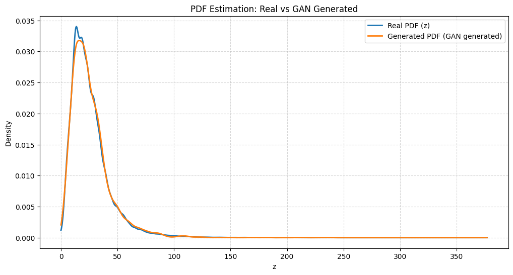

## Assignment-4: Learning Probability Density Function using GAN

## 1. Task Description

The objective of this assignment is to learn and replicate the probability distribution of real-world environmental sensor data using a Generative Adversarial Network (GAN). The task focuses on modeling the feature distribution of the transformed variable $z$ and generating synthetic samples that closely resemble the real data distribution.

Workflow: <br>
(a) Mapping the original feature $x$ to a transformed variable $z$ using a roll-number-dependent sine function.<br>
(b) Training a GAN using real transformed data samples.<br>
(c) Generating synthetic samples from the trained generator.<br>
(d) Estimating Probability Density Functions (PDFs) of both real and generated samples using KDE.<br>
(e) Comparing the real and generated distributions using divergence metrics and visualization.<br>

## 2. Methodology

### 2.1 Data Transformation ($x \rightarrow z$)

The transformation function is defined as:

$$
z = T_{r}(x) = x + a_r \sin(b_r x)
$$

Constants for Roll Number 102497023:
- $a_r = 0.05 \times (102497023 \pmod 7) = \mathbf{0.3}$
- $b_r = 0.3 \times (102497023 \pmod 5 + 1) = \mathbf{1.2}$

The sine term introduces a periodic oscillation (non-linear drift) into the $NO_2$ distribution, making the transformed data distribution more complex and non-Gaussian.

### 2.2 GAN Architecture Overview

A GAN consists of two neural networks trained in competition:

- **Generator ($G$):** Takes random noise $n$ as input and generates fake samples.
- **Discriminator ($D$):** Classifies whether an input sample is real (from the dataset) or fake (generated).

The training objective is formulated as a minimax game:

$$
\min_{G}\max_{D} V(D,G)
$$

where the discriminator learns to distinguish real vs fake samples, and the generator learns to fool the discriminator.


### 2.3 Training Objective

The discriminator maximizes the objective:

$$
\mathbb{E}_{x \sim p_{\text{data}}(x)}[\log D(x)]
+
\mathbb{E}_{n \sim p_n(n)}[\log(1 - D(G(n)))]
$$

while the generator minimizes:

$$
\mathbb{E}_{n \sim p_n(n)}[\log(1 - D(G(n)))]
$$

During training:
- The discriminator improves its ability to classify real vs fake samples.
- The generator improves the realism of its generated samples.

Over time, the generator learns to produce samples whose distribution closely matches the real transformed data distribution.

### 2.4 PDF Estimation using Kernel Density Estimation (KDE)

Since GAN outputs are discrete generated samples, a smooth Probability Density Function (PDF) is estimated using Gaussian Kernel Density Estimation (`gaussian_kde`). KDE provides a continuous density curve, making it suitable for comparing real and generated distributions.

To quantitatively evaluate similarity between the real distribution and GAN-generated distribution, divergence-based metrics were computed using `scipy.stats`.

#### 1. Kullback–Leibler (KL) Divergence

KL divergence measures how much one probability distribution differs from another reference distribution. It is defined as:

$$
D_{KL}(P \Vert Q) = \sum_{i} P(i)\log\left(\frac{P(i)}{Q(i)}\right)
$$

#### 2. Jensen–Shannon (JS) Divergence

Jensen–Shannon divergence is a symmetric and more stable divergence metric derived from KL divergence. It is defined as:

$$
D_{JS}(P \Vert Q) = \frac{1}{2}D_{KL}(P \Vert M) + \frac{1}{2}D_{KL}(Q \Vert M)
$$

where

$$
M = \frac{1}{2}(P+Q)
$$

In this assignment, divergence metrics were computed using:

```python
from scipy.stats import entropy

kl_div = entropy(pdf_real, pdf_fake)

M = 0.5 * (pdf_real + pdf_fake)
js_div = 0.5 * entropy(pdf_real, M) + 0.5 * entropy(pdf_fake, M)
```

Here:
- `pdf_real` represents the true distribution $P$
- `pdf_fake` represents the generated approximation $Q$

### Interpretation of Divergence Metrics

- KL Divergence $D_{KL}(P \Vert Q)$ becomes 0 only when real and generated distributions are identical.
- A higher KL value indicates greater mismatch.
- KL divergence is asymmetric:

$$
D_{KL}(P \Vert Q) \neq D_{KL}(Q \Vert P)
$$

**Important:** KL can become `inf` if the generated distribution assigns zero probability where the real distribution has non-zero probability.

- JS Divergence $D_{JS}(P \Vert Q)$ is symmetric, finite, and bounded, making it more stable for GAN evaluation.
- $D_{JS} = 0$ indicates perfect overlap.
- A smaller JS value means the GAN has learned the real distribution more accurately.

## 3. Input/Output

**Input:** India Air Quality Dataset (Kaggle), specifically the `no2` feature.
<br>**Data Source:** [Kaggle] [Click here](https://www.kaggle.com/datasets/shrutibhargava94/india-air-quality-data)

**Output:** GAN-generated synthetic samples and distribution comparison plots (Real vs Generated PDF).

## 4. Results

### 4.1 PDF Comparison (Real vs GAN Generated)

The KDE-based probability density estimation shows that the GAN-generated distribution aligns closely with the real distribution.



### 4.2 Divergence Metrics

| Metric        | Value  |
| ------------- | ------ |
| KL Divergence | inf    |
| JS Divergence | 0.0010 |

## 5. Observations

### 5.1 Mode Coverage

From the KDE plot, the real PDF and GAN-generated PDF show a single dominant peak (mode) around $𝑧 ≈ 10$ to $z ≈ 20$. The generated distribution successfully captures this main peak and follows the overall shape of the real distribution.
This indicates that the GAN has achieved **good mode coverage**, and no major mode collapse is observed.

### 5.2 Training Stability

The generated PDF curve is smooth and closely aligned with the real curve across most regions, which suggests that GAN training was stable.
There are no abnormal spikes, oscillations, or discontinuities in the generated density curve, indicating that the generator and discriminator maintained a balanced learning process.

Thus, the training process appears stable without divergence or collapse.

### 5.3 Quality of Generated Distribution

The generated PDF overlaps very closely with the real PDF, especially in the high-density region (0–60), where most data points lie.
A slight mismatch is visible near the peak where the real distribution reaches a slightly higher density than the generated one.

In the tail region $(z>60)$, both curves decay similarly and remain nearly identical, showing that the GAN also learned the long-tail behavior reasonably well.

Overall, the GAN-generated distribution shows **high-quality approximation** of the real distribution.

## 6. Conclusion

This experiment confirms that a GAN can successfully learn and reproduce the probability distribution of real-world environmental data. The close overlap between the KDE-estimated real and generated PDFs demonstrates effective distribution learning.

The Jensen–Shannon divergence value of 0.0010 further indicates that the generator has achieved a high-quality approximation of the real data distribution.
